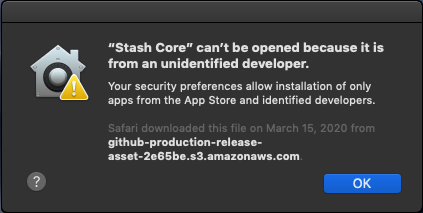
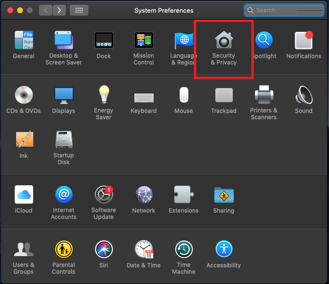
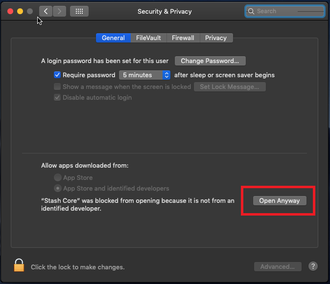
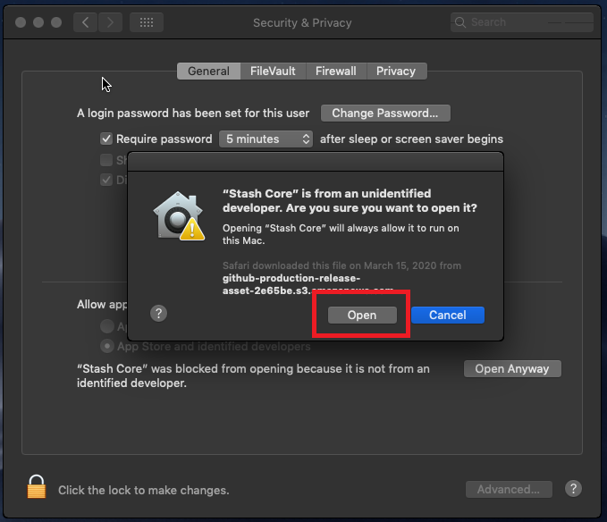

Running Stash Core on MacOSX
================

Becasue Stash Core is not currently signed with an official Apple developer certificate, you may recieve th following GateKeeper error when attemping to run Stash Core for the first time.

How to fix
--------------------------

- Navigate to `System Preferences`, then go to the `Security & Privacy`.

- On the `General` tab, click `Open Anyway`.

- Finally click `Open`. From this point on Stash Core should now run without having to go through these steps.

